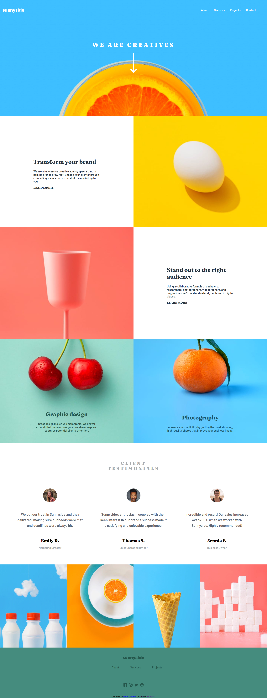

# Frontend Mentor - Sunnyside agency landing page solution

This is a solution to the [Sunnyside agency landing page challenge on Frontend Mentor](https://www.frontendmentor.io/challenges/sunnyside-agency-landing-page-7yVs3B6ef). Frontend Mentor challenges help you improve your coding skills by building realistic projects.

## Table of contents

- [Overview](#overview)
  - [The challenge](#the-challenge)
  - [Screenshot](#screenshot)
  - [Links](#links)
- [My process](#my-process)
  - [Built with](#built-with)
  - [What I learned](#what-i-learned)
  - [Continued development](#continued-development)
  - [Useful resources](#useful-resources)
- [Author](#author)
- [Acknowledgments](#acknowledgments)

**Note: Delete this note and update the table of contents based on what sections you keep.**

## Overview

### The challenge

Users should be able to:

- View the optimal layout for the site depending on their device's screen size
- See hover states for all interactive elements on the page

### Screenshot

### Links

- Solution URL: [https://github.com/bajers777/sunnyside-agency-landing-page-main]
- Live Site URL: [https://bajers777.github.io/sunnyside-agency-landing-page-main/]

## My process

### Built with

- Semantic HTML5 markup
- CSS custom properties
- Flexbox
- Mobile-first workflow

**Note: These are just examples. Delete this note and replace the list above with your own choices**

### What I learned

In this project I mostly use flexbox and this was main feature I want to learn. This is also my first (so far) completed project where I have to stick a very exact guidelines - primary and secondary site colors, typography, etc. Before that I used GIMP to "slice" template and search Google Fonts for right typography which was a bad habit.

I made progress in learning Media Queries, this is something new to me because before I mostly used Bootstrap without knowledge of Media Queries and sometimes I wasn't able to understand how BS works or why it doesn't. More luck than skills. This is milestone for my study, I'm looking forward to use more often Media Queries.

### Continued development

In the next project I want to learn CSS animations and I want to use more JS. I'll back to this one in future and I'll add some new features:
- smooth "hamburger menu" animation,
- animations in <section> and <articles>,
- cookies pop up messenges show up in next few second after user visit website,
- animated slider,
- JS gallery.

### Useful resources

- [Flexbox](https://css-tricks.com/snippets/css/a-guide-to-flexbox/) - Really helpfull tutorial for flexbox.

## Author

- Website - [Łukasz Bajerowski](https://github.com/bajers777)
- Frontend Mentor - [@bajers777](https://www.frontendmentor.io/profile/bajers777)

## Acknowledgments

If you reading this and you're from Poland, come join best FB group to start front-end programming [HTML, CSS i JS: pierwsze kroki](https://www.facebook.com/groups/742940452405327)